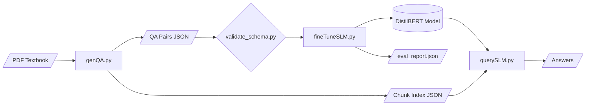

# Acamethics

A toolkit for generating question-answer pairs from middle and high school math
textbook PDFs and fine-tuning a small language model to answer those questions.
The system has three main scripts forming a complete pipeline (generate, train,
query) plus supporting utilities for validation and testing.

## Quick Start

```bash
# Install dependencies
pip install -r requirements.txt

# Run the smoke test to verify everything works
python smoke_test.py
```

## Repository Layout

```
.
├── genQA.py              # PDF to QA pair generation (two-pass)
├── fineTuneSLM.py        # DistilBERT fine-tuning for extractive QA
├── querySLM.py           # Inference CLI / web server with auto-retrieval
├── validate_schema.py    # Standalone JSON schema checker
├── smoke_test.py         # End-to-end pipeline smoke test
├── requirements.txt      # Python dependencies
├── sample_data/
│   └── sample_qa.json    # 15 ready-to-use math QA pairs
└── README.md
```

## Pipeline Overview

The pipeline has four stages. The diagram below shows how data flows between
them.



All three main scripts use the same model family consistently:

| Stage | Model | Type |
|---|---|---|
| QA Generation (genQA) | T5-QA-QG or FLAN-T5 | Text-to-text (generative) |
| Answer Extraction (genQA -x) | DistilBERT-SQuAD | Extractive QA |
| Fine-tuning (fineTuneSLM) | DistilBERT | Extractive QA |
| Inference (querySLM) | DistilBERT | Extractive QA |

The generation step uses a T5 model to create questions and optionally a
DistilBERT model to extract answers. An **extractive filter** ensures every
answer is a verbatim substring of its context, guaranteeing compatibility with
the downstream fine-tuning step. The fine-tuning and query steps both operate on
DistilBERT, so saved weights are fully compatible.

## Components

### 1. QA Generator (`genQA.py`)

Two-pass system that reads a PDF, generates QA pairs, validates them, and
exports both a QA JSON and an optional chunk index for retrieval.

```
python genQA.py -i textbook.pdf -o qa_pairs.json -m 1 -x --export-chunks chunks.json
```

```
Arguments:
  -i, --input           Path to input PDF file
  -o, --output          Path for output JSON file
  -w, --weights         Directory to store model weights (default: weights)
  -m, --model {0,1}     0=T5-QA-QG (default), 1=FLAN-T5
  -x, --extractive      Enable extractive QA for better answers
  --export-chunks PATH  Save chunk index JSON (used by querySLM for retrieval)
  --enhance-only PATH   Enhance an existing JSON instead of generating from PDF
```

**Pass 1** extracts text, splits it into content-aware chunks, generates
questions with the T5 model, and produces answers via extractive and/or
generative methods. A deduplication step removes near-identical QA pairs, and an
**extractive filter** drops any pair whose answer is not a verbatim substring of
the context.

**Pass 2** validates question and answer quality, scores each pair, filters out
low-quality entries (score below 0.4), and tags each pair with question type,
difficulty level, and topic keywords.

The `--export-chunks` flag saves the chunk index as a separate JSON file. This
file is consumed by `querySLM.py` to enable automatic context retrieval so users
do not need to paste context manually.

#### Model Options

- **Best quality:** `-m 1 -x` (FLAN-T5 + extractive)
- **Speed:** `-m 0` (T5 small, no extractive)
- **Balanced:** `-m 0 -x` (T5 small + extractive)

### 2. Schema Validator (`validate_schema.py`)

Standalone script that checks JSON files before they enter fine-tuning.

```bash
# Validate a single file
python validate_schema.py sample_data/sample_qa.json

# Validate a directory of files
python validate_schema.py training_data/

# Strict mode (exit 1 if any pair fails)
python validate_schema.py --strict training_data/
```

Checks performed on each pair: required keys present (question, answer,
context), non-empty strings, answer is a verbatim substring of context, question
ends with `?`, answer has at least 3 words.

### 3. Fine-tuning (`fineTuneSLM.py`)

Fine-tunes a DistilBERT extractive QA model on the generated QA pairs. Includes
schema validation, post-training text-level evaluation, and an evaluation report.

```
python fineTuneSLM.py -i training_data -t checkpoints -w model_output
```

```
Arguments:
  -i, --input-dir                   Directory containing JSON files
  -t, --tmp-dir                     Directory for training checkpoints
  -w, --output-dir                  Directory for the final model
  --resume-from PATH                Resume from a checkpoint
  --num-epochs N                    Training epochs (default: 3)
  --batch-size N                    Batch size (default: 8)
  --learning-rate F                 Learning rate (default: 2e-5)
  --gradient-accumulation-steps N   Gradient accumulation (default: 1)
```

After training, the script:

1. Runs Trainer evaluation (position-level SQuAD F1/EM)
2. Runs **text-level evaluation** that decodes predicted spans to text and
   computes token-level F1 and exact match on the validation set
3. Saves an `eval_report.json` alongside the model with both metric sets and
   dataset statistics

### 4. Query Interface (`querySLM.py`)

Loads the fine-tuned DistilBERT model for inference. Supports automatic context
retrieval via a TF-IDF index over chunks exported by `genQA.py`.

```
python querySLM.py -m model_output --mode server --chunk-index chunks.json
```

```
Arguments:
  -m, --model_dir       Directory containing the fine-tuned model
  --mode {cli,server}   Run mode (default: cli)
  --chunk-index PATH    Chunk index JSON for automatic context retrieval
  -i, --input           Input file (CLI mode)
  -o, --output          Output file (CLI mode)
  --port N              Server port (default: 5000)
```

When `--chunk-index` is provided, the system builds a TF-IDF index over all
chunks at startup. For each question (whether from the CLI, the web GUI, or the
REST API), the retriever finds the top-3 most relevant chunks and the model
extracts an answer from the best-matching one. Users no longer need to paste
context manually.

#### CLI mode

Input file format (one entry per line):

```
What is a prime number?
What is the Pythagorean theorem?	In a right triangle the square of the hypotenuse equals the sum of the squares of the other two sides.
```

Plain questions get context auto-retrieved (if `--chunk-index` is set).
Questions with a tab-separated context use that context directly.

```bash
python querySLM.py -m ./model --mode cli -i questions.txt -o answers.txt --chunk-index chunks.json
```

#### Server mode

```bash
python querySLM.py -m ./model --mode server --port 8080 --chunk-index chunks.json
```

Endpoints:

- `GET /` -- web GUI (context field is optional when retrieval is enabled)
- `POST /query` -- JSON API: `{"question": "...", "context": "..."}`
- `GET /health` -- returns model status and whether retrieval is enabled

### 5. Smoke Test (`smoke_test.py`)

Runs the full pipeline end-to-end using `sample_data/sample_qa.json` to verify
everything works before you commit to a real PDF.

```bash
python smoke_test.py [--sample-data path/to/sample_qa.json]
```

Tests performed:

1. Schema validation of sample data
2. Fine-tuning for 1 epoch on CPU
3. Text-level evaluation on the validation split
4. Single-question inference
5. TF-IDF chunk retrieval

Runs in under 5 minutes on CPU. No GPU or PDF required.

## Complete Workflow

```bash
# 1. Generate QA pairs and chunk index from a textbook
python genQA.py -i textbook.pdf -o qa_pairs.json -m 1 -x \
    -w ./weights --export-chunks chunks.json

# 2. Validate the output before training
python validate_schema.py qa_pairs.json

# 3. Fine-tune (creates model + eval_report.json)
mkdir -p training_data
cp qa_pairs.json training_data/
python fineTuneSLM.py -i training_data -t ./checkpoints -w ./math_model \
    --num-epochs 5 --batch-size 16

# 4a. Interactive web interface with auto-retrieval
python querySLM.py -m ./math_model --mode server --chunk-index chunks.json

# 4b. Batch processing
python querySLM.py -m ./math_model --mode cli \
    -i questions.txt -o answers.txt --chunk-index chunks.json
```

## Sample Data

The repository includes `sample_data/sample_qa.json` with 15 middle/high-school
math QA pairs. Every answer is a verbatim substring of its context, making them
ready for fine-tuning without any preprocessing. Use this file to test the
pipeline or as a template for creating your own training data manually.

## Technical Requirements

- **Python:** 3.8+
- **Memory:** 8 GB RAM minimum, 16 GB+ recommended for large PDFs
- **Storage:** approximately 5 GB for model weights
- **GPU:** Optional but recommended (CUDA or Apple MPS supported)

Install all dependencies:

```bash
pip install -r requirements.txt
```